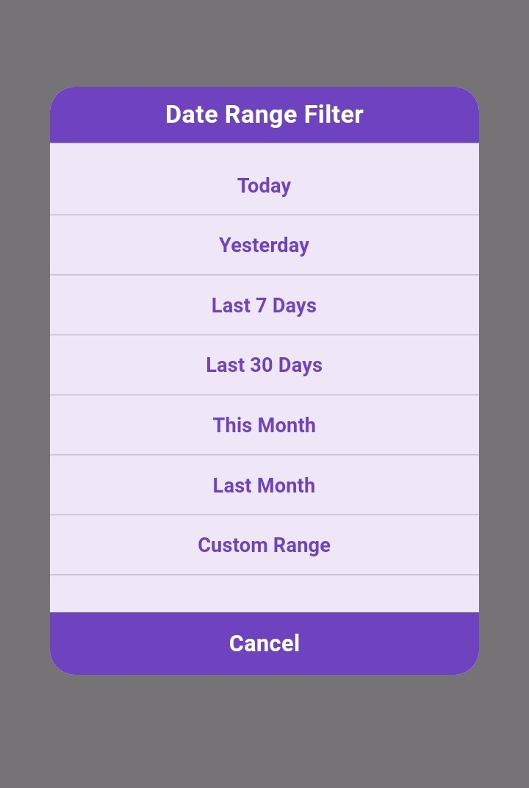

# Date Range Filter

A flutter library to get date range.

  

## How to use
Add this package to pubspec.yaml and then import.

```dart
 import 'package:date_range_filter/date_range_filter.dart';
 ```

 ```dart
List<DateTime> dateRange = await DateRangeFilter(
       ontext: context,
       color: Theme.of(context).primaryColor,
  ).getSelectedDate;
 ```


# Thanks
